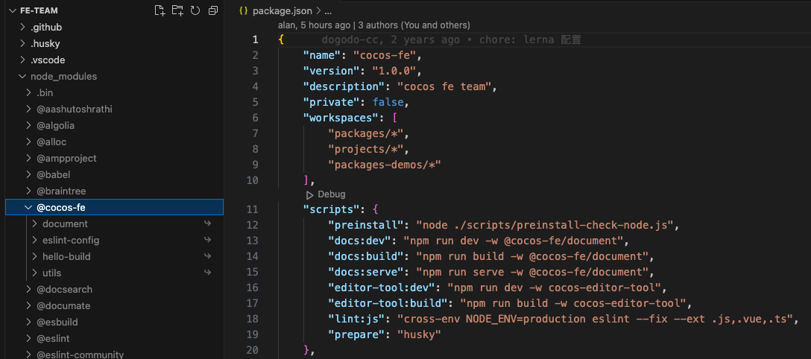
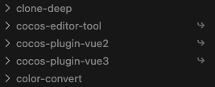

# cocos-FE

cocos creator FE team

由于使用了 npm@7 的 workspace 功能，所以 `node` 版本需要在 16 以上。 推荐使用 `nvm` 来管理 `node` 版本。

[cocos-fe 官网](http://cocos.90s.co/)

## 本地引用

开启 npm 的 workspaces 功能

```json
{
    "name": "cocos-fe",
    "version": "1.0.0",
    "description": "cocos fe team",
    "private": false,
    "workspaces": ["packages/*", "projects/*", "packages-demos/*"]
}
```

此时执行 `npm install` 会在 `node_modules` 里生成命中的包的软连接。

比如 packages/\* 的文件夹结构如下：

```sh
- packages
-- eslint-config
-- hell-build
-- utils
```

且它们的 package.json 的名称符合格式： `@cocos-fe/xxx`，那么 node_modules 中将生成如下的结构：



所以推荐需要对外发布的统一以 `@cocos-fe/xxx` 的格式命名。

这样在当前项目范围内，就可以直接

```js
import xxx from '@cocos-fe/xxx';
```

如果不按照格式命名，辨识度会降低很多：



## 发包线上

```bash
 npm config get registry 查看当前是哪个源
```

发布要切换到[官方源](https://registry.npmjs.org)

发布之后在 https://npmmirror.com/ 这里看下是否有被淘宝同步到。

安装要切换到[淘宝源](https://registry.npmmirror.com)，如果淘宝源没有及时更新，可以切到官方源进行下载。
