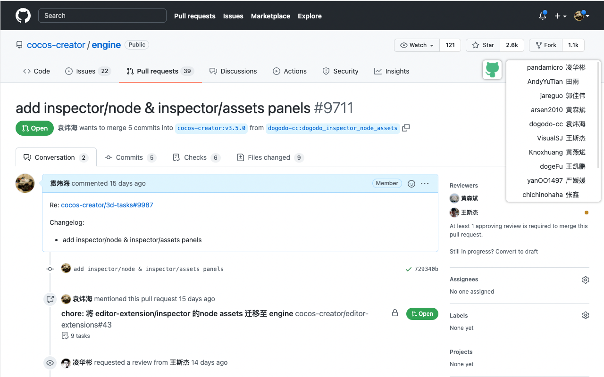
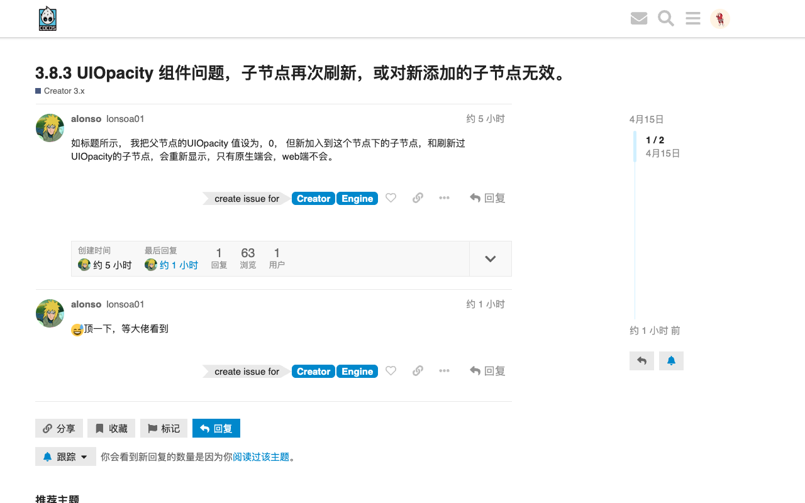

# 插件开发笔记

    <a href="https://chromewebstore.google.com/detail/eidodebdpdgnbcphggoimbpohochfpoj?authuser=0&hl=zh-CN" target="_blank">
     Chrome 商店安装
  </a>

## Github ID 汉化插件

## 论坛快速创建 Issue

## deepwiki 保存历史记录

[deepwiki](https://deepwiki.com/) 可以在输入框通过按方向「上」「下」键来获取历史输入

## npm 包对比工具

