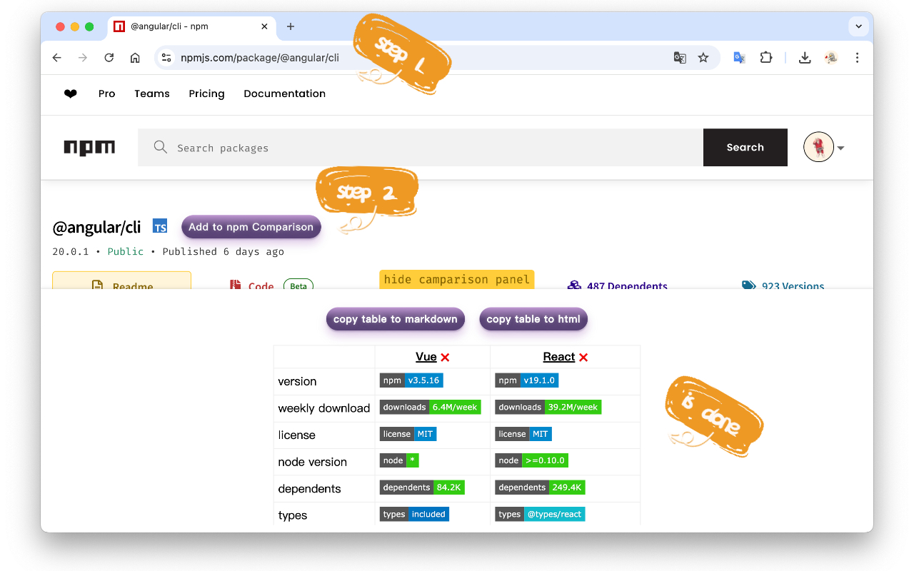

# Npm-Comparison

A browser extension designed for comparing npm packages

一款用于快速制作精美的 npm 包对比表格的浏览器插件

### 🚀 功能亮点

只需点击几次鼠标就可以生成一份精美的 npm 包对比表格。

可以直接复制到 `Markdown` 文档或者 `HTML` 文档。

让你的技术调研报告看着 👍**高** 👍**大** 👍**上**

### 下面是一份简单的示例

|                 | [vue][link_7hzi9h]                         | [react][link_q0wiqm]                       | [@angular/cli][link_6wz3oj]                |
| --------------- | ------------------------------------------ | ------------------------------------------ | ------------------------------------------ |
| version         | ![version][img_asyfav]                     | ![version][img_83afu9]                     | ![version][img_dbr3wh]                     |
| weekly download | ![weekly download][img_2u6x9m]             | ![weekly download][img_v51vlb]             | ![weekly download][img_zpfhsh]             |
| license         | ![license][img_qses12]                     | ![license][img_1clppb]                     | ![license][img_a7oqux]                     |
| node version    | ![node version][img_7nwzeo]                | ![node version][img_p4i3hw]                | ![node version][img_asv4yz]                |
| dependents      | ![dependents][img_98bapa]                  | ![dependents][img_w7dkac]                  | ![dependents][img_q47b4n]                  |
| types           | ![types][img_0te112]                       | ![types][img_iltqqx]                       | ![types][img_ban65z]                       |
| install size    | [![install size][erioa7_img]][erioa7_link] | [![install size][lurkrk_img]][lurkrk_link] | [![install size][9xp0zt_img]][9xp0zt_link] |
| stars           | [![stars][7azeso_img]][7azeso_link]        | [![stars][u6gz1y_img]][u6gz1y_link]        | [![stars][q7riln_img]][q7riln_link]        |
| last commit     | ![last commit][img_98s6h1]                 | ![last commit][img_90nwim]                 | ![last commit][img_gh66ch]                 |
| issues          | ![issues][img_u9gx33]                      | ![issues][img_y6jgdn]                      | ![issues][img_88jxay]                      |

[link_7hzi9h]: https://www.npmjs.com/package/vue
[link_q0wiqm]: https://www.npmjs.com/package/react
[link_6wz3oj]: https://www.npmjs.com/package/@angular/cli
[img_asyfav]: https://flat.badgen.net/npm/v/vue
[img_83afu9]: https://flat.badgen.net/npm/v/react
[img_dbr3wh]: https://flat.badgen.net/npm/v/@angular/cli
[img_2u6x9m]: https://flat.badgen.net/npm/dw/vue
[img_v51vlb]: https://flat.badgen.net/npm/dw/react
[img_zpfhsh]: https://flat.badgen.net/npm/dw/@angular/cli
[img_qses12]: https://flat.badgen.net/npm/license/vue
[img_1clppb]: https://flat.badgen.net/npm/license/react
[img_a7oqux]: https://flat.badgen.net/npm/license/@angular/cli
[img_7nwzeo]: https://flat.badgen.net/npm/node/vue
[img_p4i3hw]: https://flat.badgen.net/npm/node/react
[img_asv4yz]: https://flat.badgen.net/npm/node/@angular/cli
[img_98bapa]: https://flat.badgen.net/npm/dependents/vue
[img_w7dkac]: https://flat.badgen.net/npm/dependents/react
[img_q47b4n]: https://flat.badgen.net/npm/dependents/@angular/cli
[img_0te112]: https://flat.badgen.net/npm/types/vue
[img_iltqqx]: https://flat.badgen.net/npm/types/react
[img_ban65z]: https://flat.badgen.net/npm/types/@angular/cli
[erioa7_link]: https://packagephobia.com/result?p=vue
[erioa7_img]: https://packagephobia.com/badge?p=vue
[lurkrk_link]: https://packagephobia.com/result?p=react
[lurkrk_img]: https://packagephobia.com/badge?p=react
[9xp0zt_link]: https://packagephobia.com/result?p=@angular/cli
[9xp0zt_img]: https://packagephobia.com/badge?p=@angular/cli
[7azeso_link]: https://github.com/vuejs/core/tree/main/packages/vue#readme
[7azeso_img]: https://img.shields.io/github/stars/vuejs/core?color=white&label
[u6gz1y_link]: https://react.dev/
[u6gz1y_img]: https://img.shields.io/github/stars/facebook/react?color=white&label
[q7riln_link]: https://github.com/angular/angular-cli
[q7riln_img]: https://img.shields.io/github/stars/angular/angular-cli?color=white&label
[img_98s6h1]: https://flat.badgen.net/github/last-commit/vuejs/core
[img_90nwim]: https://flat.badgen.net/github/last-commit/facebook/react
[img_gh66ch]: https://flat.badgen.net/github/last-commit/angular/angular-cli
[img_u9gx33]: https://flat.badgen.net/github/issues/vuejs/core
[img_y6jgdn]: https://flat.badgen.net/github/issues/facebook/react
[img_88jxay]: https://flat.badgen.net/github/issues/angular/angular-cli

 也支持反转表格方向 

| package name                | version                | weekly download                | license                | node version                | dependents                | types                | install size                               | stars                               | last commit                | issues                |
| --------------------------- | ---------------------- | ------------------------------ | ---------------------- | --------------------------- | ------------------------- | -------------------- | ------------------------------------------ | ----------------------------------- | -------------------------- | --------------------- |
| [vue][link_0as2bd]          | ![version][img_0kgprd] | ![weekly download][img_dihcl1] | ![license][img_jw72v8] | ![node version][img_r6ryxv] | ![dependents][img_bo4mqk] | ![types][img_kgvopx] | [![install size][aa43ii_img]][aa43ii_link] | [![stars][vos3yg_img]][vos3yg_link] | ![last commit][img_myim5h] | ![issues][img_zi3ikw] |
| [react][link_12mtjh]        | ![version][img_3d0a9j] | ![weekly download][img_cbcday] | ![license][img_p21yjq] | ![node version][img_ap1nd4] | ![dependents][img_s1tciq] | ![types][img_ylkwec] | [![install size][6hlshp_img]][6hlshp_link] | [![stars][g9oyux_img]][g9oyux_link] | ![last commit][img_4b2c45] | ![issues][img_ofmxjh] |
| [@angular/cli][link_rvgf2l] | ![version][img_xk99g4] | ![weekly download][img_6vcbys] | ![license][img_kng3s0] | ![node version][img_f8u80k] | ![dependents][img_vjn9fh] | ![types][img_30xb50] | [![install size][m8g7bp_img]][m8g7bp_link] | [![stars][yx7j6s_img]][yx7j6s_link] | ![last commit][img_iqtml2] | ![issues][img_48hzl9] |

[link_0as2bd]: https://www.npmjs.com/package/vue
[img_0kgprd]: https://flat.badgen.net/npm/v/vue
[img_dihcl1]: https://flat.badgen.net/npm/dw/vue
[img_jw72v8]: https://flat.badgen.net/npm/license/vue
[img_r6ryxv]: https://flat.badgen.net/npm/node/vue
[img_bo4mqk]: https://flat.badgen.net/npm/dependents/vue
[img_kgvopx]: https://flat.badgen.net/npm/types/vue
[aa43ii_link]: https://packagephobia.com/result?p=vue
[aa43ii_img]: https://packagephobia.com/badge?p=vue
[vos3yg_link]: https://github.com/vuejs/core/tree/main/packages/vue#readme
[vos3yg_img]: https://img.shields.io/github/stars/vuejs/core?color=white&label
[img_myim5h]: https://flat.badgen.net/github/last-commit/vuejs/core
[img_zi3ikw]: https://flat.badgen.net/github/issues/vuejs/core
[link_12mtjh]: https://www.npmjs.com/package/react
[img_3d0a9j]: https://flat.badgen.net/npm/v/react
[img_cbcday]: https://flat.badgen.net/npm/dw/react
[img_p21yjq]: https://flat.badgen.net/npm/license/react
[img_ap1nd4]: https://flat.badgen.net/npm/node/react
[img_s1tciq]: https://flat.badgen.net/npm/dependents/react
[img_ylkwec]: https://flat.badgen.net/npm/types/react
[6hlshp_link]: https://packagephobia.com/result?p=react
[6hlshp_img]: https://packagephobia.com/badge?p=react
[g9oyux_link]: https://react.dev/
[g9oyux_img]: https://img.shields.io/github/stars/facebook/react?color=white&label
[img_4b2c45]: https://flat.badgen.net/github/last-commit/facebook/react
[img_ofmxjh]: https://flat.badgen.net/github/issues/facebook/react
[link_rvgf2l]: https://www.npmjs.com/package/@angular/cli
[img_xk99g4]: https://flat.badgen.net/npm/v/@angular/cli
[img_6vcbys]: https://flat.badgen.net/npm/dw/@angular/cli
[img_kng3s0]: https://flat.badgen.net/npm/license/@angular/cli
[img_f8u80k]: https://flat.badgen.net/npm/node/@angular/cli
[img_vjn9fh]: https://flat.badgen.net/npm/dependents/@angular/cli
[img_30xb50]: https://flat.badgen.net/npm/types/@angular/cli
[m8g7bp_link]: https://packagephobia.com/result?p=@angular/cli
[m8g7bp_img]: https://packagephobia.com/badge?p=@angular/cli
[yx7j6s_link]: https://github.com/angular/angular-cli
[yx7j6s_img]: https://img.shields.io/github/stars/angular/angular-cli?color=white&label
[img_iqtml2]: https://flat.badgen.net/github/last-commit/angular/angular-cli
[img_48hzl9]: https://flat.badgen.net/github/issues/angular/angular-cli
