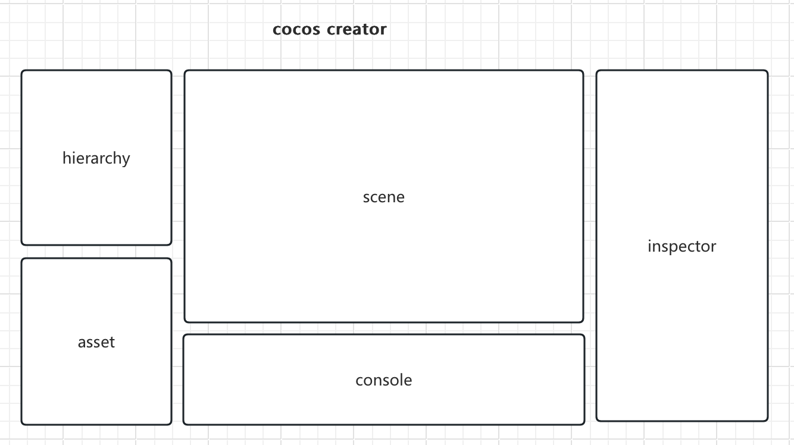
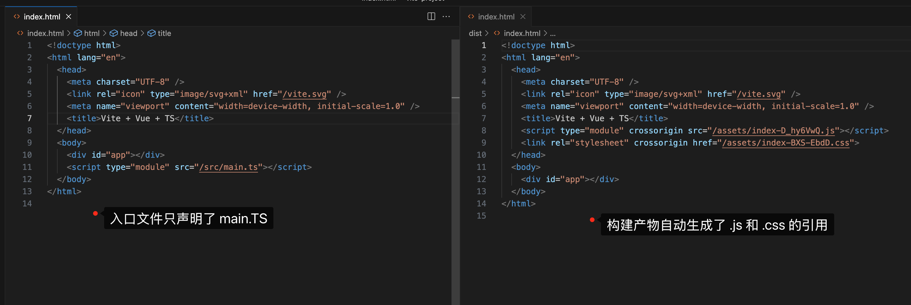
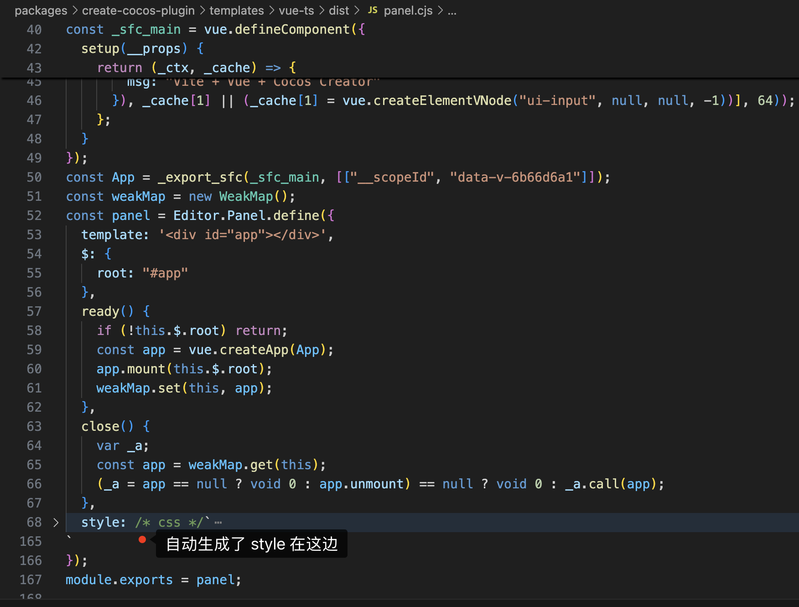

# 开发 COCOS Creator 插件的较佳实践

## 前言

cocos creator 编辑器是由一系列的插件组装而成的，在 creator 底层有一套完善的插件机制，它们可以相互通信，编辑器界面可以自由拼装。



如图，这是一个常见的编辑器界面，它是由若干个插件一起拼装起来的。

所以要拓展编辑器，就是要学会如何编写编辑器插件，详细教程可以查看[官方教程](https://docs.cocos.com/creator/3.8/manual/zh/editor/extension/readme.html)

阅读此文，我们假设你已经熟悉了 creator 插件开发流程，知道通过插件可以拓展哪些编辑器的能力。所以本文不会对如何编写插件做太详细的介绍。

本文将只围绕着，如何让编写编辑器插件`更简单`，`更符合人体工学`，以及`享受当前时代 web 工程化的所有成果`。

## 当前的痛点

编辑器插件支持渲染面板，也就是在 package.json 里声明的 panels 的配置。比如:

```json{7-11}
{
    "name": "console",
    "version": "1.0.0",
    "description": "i18n:console.description",
    "main": "./dist/browser.js", // 主程序

    "panels": {
        "default": {
            "main": "./dist/panel.js" // 面板
        }
    },

    "contributions": {
        "footer": {
            "left": "./dist/footer/left.js", // 拓展
            "right": "./dist/footer/right.js" // 拓展
        }
    }
}
```

可以看出，一个面板的入口文件是一个 js 文件。配置中是 panel.js。

我们来看下一个 panel 文件的结构：

```js
export const template = '<div id="app"> ...other more html </div>';

export const style = '<style> #app {...other more css} </style>';

export const $ = { root: '#app' };

export function update() {}

export function ready() {}

export function close() {}
```

这和大家平时做的 web 项目有点区别。 常见的 web 项目，一般渲染一个面板是声明一个 HTML 的入口文件。

而且 HTML 文件天然的支持 css + html + javascript 混合导入。

```html
<html>
    <style>
        /* css */
    </style>
    <body>
        <div>...other more html</div>
    </body>
    <script>
        // js;
    </script>
</html>
```

编辑器底层的插件系统将入口文件设计成了一个 js 文件，然后将这个 js 文件在封装好的 `panel-frame` web-component 里去做渲染。目的是更好的管理面板的生命周期，样式隔离，也可以更好的做通信。

带来的问题就是没有很好的案例告诉大家如何组织 html + css + js 。以及如何接入现代化的前端工程来开发编辑器插件。

如果采用入口文件为 html 的方式，则会将每个面板以 iframe 的方式去渲染，这样会导致消息通信更复杂。

`主进程 - 渲染进程 - iframe` VS `主进程 - 渲染进程(web-component)`

少了一层桥接的过程。

现在，我们明白了编辑器的插件为何如此设计，也明白了这样设计带来的好处和开发的痛点。

## 当前都是怎么做的

常规写法：

```js
export const template = '<div id="app"> ...other more html </div>';

export const style = '<style> #app {...other more css} </style>';

export const $ = { root: '#app' };

export function update() {}

export function ready() {}

export function close() {}
```

如果插件足够简单，这样做也没什么问题，但是一般插件面板都挺复杂的，复杂度经常大于一般 web 应用。 所以也见过这样来组织 panel 的：

```js
import { join } from 'path';
import { readFileSync } from 'fs';

export const template = readFileSync(join(__dirname, 'path/to/panel.html'), 'utf8');

export const style = readFileSync(join(__dirname, 'path/to/panel.css'), 'utf8');

export const $ = { root: '#app' };

export function update() {}

export function ready() {}

export function close() {}
```

这样从一定程度上将代码进行了划分，职责更清晰了，但是还是采用命令式的方式去写页面。（注意：这样还在渲染进程使用了 node 的 api，在 electron 的最佳实践是不推荐的）

更有追求的小伙伴会引入 vue 来享受声明式的写法，用数据驱动页面。

如下：

```js
import { join } from 'path';
import { readFileSync } from 'fs';
import Vue from 'vue';

export const template = '<div id="app"></div>';

export const style = readFileSync(join(__dirname, 'path/to/panel.css'), 'utf8');

export const $ = { root: '#app' };

export function update() {}

export function ready() {
    // 看我，它还是 html 分离的方式，没有采用单文件
    const vueTpl = readFileSync(join(__dirname, 'path/to/panel.html'), 'utf8');

    new Vue({
        el: this.$.root, // 将实例挂载到  #app
        template: vueTpl,
    });
}

export function close() {}
```

达到这步的同学已经算进阶了，因为它好歹享受到了数据驱动，在控制视图的时候已经更得心应手了。

## 理想状态是什么样的

以上的例子可以看出，我们都是在以`人为`的方式去适应 panle 的结构，我们需要关注 html ，需要关注 css ，需要关注 js 。

我们希望可以享受组件化的开发，比如单文件 .vue ，以及 .jsx 这样的文件后缀，采用完整的现代化的框架来开发。

如今的前端工程化已经非常成熟，UI 方面有 vue 、react、 angular 等。构建方面有 vite、 webpack、等

下面我们就以 vite + vue 为例子，探索一个完美的插件开发体验。

## 引入 vite

[vite](https://vite.dev/) 用来构建 web 应用是非常流行且成熟的方案，而且它官方维护了多套 UI 框架的模板，为我们后期开发自己的 CLI 工具提供了极大的启发 （其实我基本完全抄它的）。

### lib 模式

vite 的构建入口是 index.html 文件，而我们的 panel 的入口文件是 xx.js ,所以我们只能使用 vite 提供的 lib 模式。（这样失去了 HMR 的能力）。

基于 lib 模式，我们 vite 配置大概如下：

```js
import { defineConfig } from 'vite';
import { nodeExternals } from 'rollup-plugin-node-externals';

export default defineConfig(({ mode }) => {
    /**
     *  注意事项:
     *  vite 在构建 lib 模式的时候，是没有 dev 服务的，dev 主要用于 web 应用
     *  所以在 package.json 的 scripts 里 dev 和 build 都是执行 vite build
     *  只是在 dev 的脚本里，手动指定了 "--mode development" https://cn.vitejs.dev/guide/env-and-mode.html
     *  然后在 development 模式下，我们配置 watch 的配置
     */
    const isDev = mode === 'development';

    return {
        build: {
            lib: {
                entry: {
                    browser: './src/browser/index.js',
                    panel: './src/panel.js',
                    panel_sub: './src/panel-sub.js',
                },
                formats: ['cjs'],
                fileName: (_, entryName) => `${entryName}.cjs`,
            },
            // 重要: vite 默认将构建出来的 css 命名为 style.css ，但是我们的 panel 可能有多个，需要每个 panel 生成自己的 css 文件，要开启 cssCodeSplit
            cssCodeSplit: true,
            watch: isDev
                ? {
                      include: ['./src/**/*.js', './src/**/*.css'],
                  }
                : null,
            minify: false,
        },
        plugins: [],
    };
});
```

然后我们的 panel.js 就可以这样写：

```js {13}
import App from './App.vue';
import { createApp } from 'vue';
import { readFileSync } from 'fs';
import { join } from 'path';


const weakMap = new WeakMap();

export default Editor.Panel.define({
    template: '<div id="app"></div>', // 只留一个 div 用于 vue 的挂载

    // 注意: 这边是引入通过 vite 构建且分离出来的 css 文件，一般在 dist 文件夹中
    style: readFileSync(join(__dirname, 'path/to/panel.css'), 'utf8');
    $: {
        root: '#app',
    },
    ready() {
        if (!this.$.root) return;

        const app = createApp(App);
        app.mount(this.$.root);

        weakMap.set(this, app);
    },
    close() {
        const app = weakMap.get(this);
        app?.unmount?.();
    },
});

```

其实到这步，我们已经可以使用完整的单文件 .vue 来开发面板了，你可以像开发常规 web 应用一样通过组件化去组装你的应用。

但是目前还遗留一个问题，我们在 panel.js 里面去手动引入了`构建出来的css`文件，在源码里引入预期的构建出的产物，是一种反直觉的操作。

### 编写 vite 插件 @cocos-fe/vite-plugin-cocos-panel

[npm 下载地址](https://www.npmjs.com/package/@cocos-fe/vite-plugin-cocos-panel)

我们希望能像 vite 构建 index.html 入口文件一样，自动将 css 等依赖，自动的打入到最终的 index.html 去。


也就是比如我们的 panel.ts 是这样的：

```ts
import App from './App.vue';
import { createApp } from 'vue';

const weakMap = new WeakMap();

export default Editor.Panel.define({
    template: '<div id="app"></div>', // 只留一个 div 用于 vue 的挂载
    // 注意看，我们没有写任何的 style
    $: {
        root: '#app',
    },
    ready() {
        if (!this.$.root) return;

        const app = createApp(App);
        app.mount(this.$.root);

        weakMap.set(this, app);
    },
    close() {
        const app = weakMap.get(this);
        app?.unmount?.();
    },
});
```

通过 vite 构建之后，文件是这样的：


所以我们就需要一个专门为 cocos-plugin 服务的构建插件，该插件需要做 2 件事。

-   1、 将构建配置的 build.cssCodeSplit 设置为 true

这样才可以对每个入口文件分离出属于自己的 css 样式。

-   2、 需要将分离出来的 css 样式，自动写入到 panel.js 的 style 属性中去。

在拥有这个插件之后，我们就解决了在源码里面去引入构建产物的问题，且一切都是自动完成。

### 最终形态

最终，你的 panel.ts 代码将是如下的模样：

::: code-group

```ts [vite.config.ts]
import { defineConfig } from 'vite';
import { nodeExternals } from 'rollup-plugin-node-externals';
import vue from '@vitejs/plugin-vue';
import { cocosPanelConfig, cocosPanelCss } from '@cocos-fe/vite-plugin-cocos-panel';

export default defineConfig(({ mode }) => {
    /**
     *  注意事项:
     *  vite 在构建 lib 模式的时候，是没有 dev 服务的，dev 主要用于 web 应用
     *  所以在 package.json 的 scripts 里 dev 和 build 都是执行 vite build
     *  只是在 dev 的脚本里，手动指定了 "--mode development" https://cn.vitejs.dev/guide/env-and-mode.html
     *  然后在 development 模式下，我们配置 watch 的配置
     */
    const isDev = mode === 'development';

    return {
        build: {
            lib: {
                entry: {
                    browser: './src/browser/index.ts',
                    panel: './src/panels/panel.ts',
                },
                formats: ['cjs'],
                fileName: (format, entryName) => `${entryName}.${format}`,
            },
            watch: isDev
                ? {
                      include: ['./src/**/*.ts', './src/**/*.vue', './src/**/*.css'],
                  }
                : null,
            target: 'modules',
            minify: false,
        },
        plugins: [
            vue({
                template: {
                    compilerOptions: {
                        isCustomElement: (tag) => tag.startsWith('ui-'),
                    },
                },
            }),
            nodeExternals({
                builtins: true, // 排除 node 的内置模块
                deps: false, // 将依赖打入 dist，发布的时候可以删除 node_modules
                devDeps: true,
                peerDeps: true,
                optDeps: true,
            }),
            cocosPanelConfig(),
            cocosPanelCss(),
        ],
    };
});
```

```ts [panel.ts]
import App from './App.vue';
import { createApp } from 'vue';
import './style.css';

const weakMap = new WeakMap();

export default Editor.Panel.define({
    template: '<div id="app"></div>', // 只留一个 div 用于 vue 的挂载
    $: {
        root: '#app',
    },
    ready() {
        if (!this.$.root) return;

        const app = createApp(App);
        app.mount(this.$.root);

        weakMap.set(this, app);
    },
    close() {
        const app = weakMap.get(this);
        app?.unmount?.();
    },
});
```

```vue [App.vue]
<script setup lang="ts">
import HelloWorld from './components/HelloWorld.vue';
</script>

<template>
    <div>
        <a href="https://vitejs.dev" target="_blank">
            
        </a>
        <a href="https://vuejs.org/" target="_blank">
            
        </a>
        <a href="https://www.cocos.com/" target="_blank">
            
        </a>
    </div>
    <HelloWorld msg="Vite + Vue + Cocos Creator" />
    <ui-input></ui-input>
</template>

<style scoped>
.logo {
    height: 6em;
    padding: 1.5em;
    will-change: filter;
    transition: filter 300ms;
}
.logo:hover {
    filter: drop-shadow(0 0 2em #646cffaa);
}
.logo.vue:hover {
    filter: drop-shadow(0 0 2em #42b883aa);
}
</style>
```

:::

## 结合第三方 UI 框架

有的同学希望在使用 vue 的同时，可以使用 element-plus 等框架，理论上这些框架在我们支持通过 vite 去构建单文件之后就自然的支持的，但是由于我们的 panle 最终是在一个 web-component 里面渲染的，所以需要对第三方的框架做点处理。

-   css 样式里的 :root 需要改成 :host 这样我们才能在 web-component 里面让 elment-plus 的样式生效

    我们在 [@cocos-fe/vite-plugin-cocos-panel](https://www.npmjs.com/package/@cocos-fe/vite-plugin-cocos-panel) 里做了针对 element-plus 的样式处理， ant-design 还没时间去弄，原则上原理是一样的。
    你可以配置里面加如下的参数：

    ```js {8}
    import { defineConfig } from 'vite';
    import { cocosPanelConfig, cocosPanelCss } from '@cocos-fe/vite-plugin-cocos-panel';

    export default defineConfig(({ mode }) => {
        return {
            plugins: [
                cocosPanelConfig(), // 调整配置文件
                cocosPanelCss({ ui: 'element-plus' }), // 处理第三方组件库的 css
            ],
        };
    });
    ```

-   在使用例如弹窗这样的组件是，需要将 appendTo 设置到当前 panle 的 root 也就是我们 vue 最终挂载到的那个 dom 元素

::: code-group

```js [vite.config.js] {53}
import { defineConfig } from 'vite';
import { nodeExternals } from 'rollup-plugin-node-externals';
import vue from '@vitejs/plugin-vue';
import { cocosPanelConfig, cocosPanelCss } from '@cocos-fe/vite-plugin-cocos-panel';
import AutoImport from 'unplugin-auto-import/vite';
import Components from 'unplugin-vue-components/vite';
import { ElementPlusResolver } from 'unplugin-vue-components/resolvers';

export default defineConfig(({ mode }) => {
    /**
     *  注意事项:
     *  vite 在构建 lib 模式的时候，是没有 dev 服务的，dev 主要用于 web 应用
     *  所以在 package.json 的 scripts 里 dev 和 build 都是执行 vite build
     *  只是在 dev 的脚本里，手动指定了 "--mode development" https://cn.vitejs.dev/guide/env-and-mode.html
     *  然后在 development 模式下，我们配置 watch 的配置
     */
    const isDev = mode === 'development';

    return {
        build: {
            lib: {
                entry: {
                    browser: './src/browser/index.js',
                    panel: './src/panels/panel.js',
                },
                formats: ['cjs'],
                fileName: (format, entryName) => `${entryName}.cjs`,
            },
            watch: isDev
                ? {
                      include: ['./src/**/*.js', './src/**/*.vue', './src/**/*.css'],
                  }
                : null,
            target: 'modules',
            minify: false,
        },
        plugins: [
            vue({
                template: {
                    compilerOptions: {
                        isCustomElement: (tag) => tag.startsWith('ui-'),
                    },
                },
            }),
            nodeExternals({
                builtins: true, // 排除 node 的内置模块
                deps: false, // 将依赖打入 dist，发布的时候可以删除 node_modules
                devDeps: true,
                peerDeps: true,
                optDeps: true,
            }),
            cocosPanelConfig(),
            cocosPanelCss({ ui: 'element-plus' }),
            AutoImport({
                resolvers: [ElementPlusResolver()],
            }),
            Components({
                resolvers: [ElementPlusResolver()],
            }),
        ],
    };
});
```

```js [panel.js] {19-26}
import App from './App.vue';
import { createApp } from 'vue';
import './style.css';
import 'element-plus/dist/index.css';
import 'element-plus/theme-chalk/dark/css-vars.css';
import { ElMessage } from 'element-plus';

const weakMap = new WeakMap();

export default Editor.Panel.define({
    template: '<div id="app" class="dark"></div>', // 只留一个 div 用于 vue 的挂载
    $: {
        root: '#app',
    },
    ready() {
        if (!this.$.root) return;

        const app = createApp(App);
        app.provide('appRoot', this.$.root);
        app.provide('message', (options) => {
            if (typeof options === 'string') {
                options = { message: options };
            }
            options.appendTo = options.appendTo || this.$.root;
            return ElMessage(options);
        });
        app.mount(this.$.root);

        weakMap.set(this, app);
    },
    close() {
        const app = weakMap.get(this);
        app?.unmount?.();
    },
});
```

```vue [app.vue]
<script setup>
import HelloWorld from './components/HelloWorld.vue';
import { inject } from 'vue';
import { ElMessage } from 'element-plus';

const appRootDom = inject('appRoot');
const message = inject('message');

const open = () => {
    ElMessage({
        message: 'show message',
        appendTo: appRootDom,
    });
};

function open2() {
    message('show inject message');
}
</script>

<template>
    <div>
        <a href="https://vitejs.dev" target="_blank">
            
        </a>
        <a href="https://vuejs.org/" target="_blank">
            
        </a>
        <a href="https://www.cocos.com/" target="_blank">
            
        </a>
        <a href="https://element-plus.org/zh-CN/" target="_blank">
            
        </a>
    </div>
    <HelloWorld msg="Vite + Vue + Cocos Creator + element-plus" />
    <el-button type="primary" @click="open"> show message </el-button>
    <el-button type="danger" @click="open2"> show inject message </el-button>
</template>

<style scoped>
.logo {
    height: 6em;
    padding: 1.5em;
    will-change: filter;
    transition: filter 300ms;
}
.logo:hover {
    filter: drop-shadow(0 0 2em #646cffaa);
}
.logo.vue:hover {
    filter: drop-shadow(0 0 2em #42b883aa);
}
</style>
```

:::

## create-cocos-plugin

以上，我们介绍了如何使用单文件 .vue 来编写编辑器面板，也介绍了我们封装的 vite 插件 [@cocos-fe/vite-plugin-cocos-panel](https://www.npmjs.com/package/@cocos-fe/vite-plugin-cocos-panel) 用于自动挂载样式到 panel 上。

为了方便大家快速使用，我们还准备了几个快速使用的模板。大家可以创建一个本地模板来体验下。

[create-cocos-plugin](https://www.npmjs.com/package/create-cocos-plugin) 是我们提供的 CLI 工具。它几乎完成借（chao）鉴(xi) 了 vite 的 [create-vite](https://www.npmjs.com/package/create-vite)

你只需要在终端里执行

```bash
npm create cocos-plugin@latest
```

就可以快速选择一个我们配置好的模板，进行插件的开发。

<video src="./assets/video.mov" controls></video>
