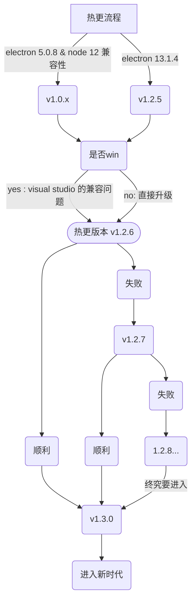
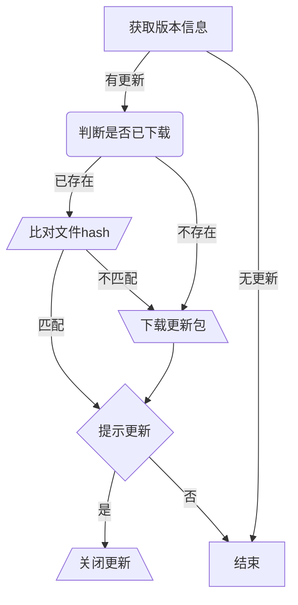
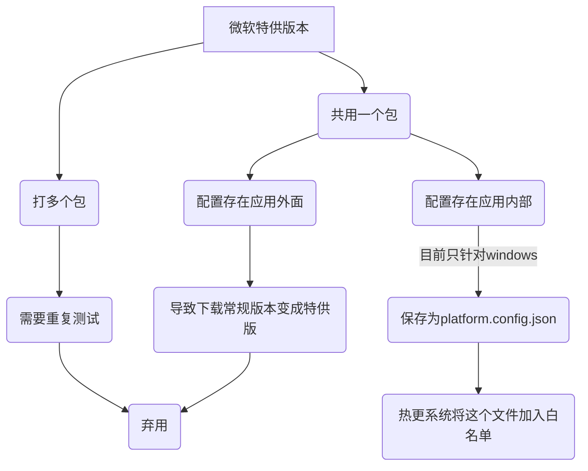
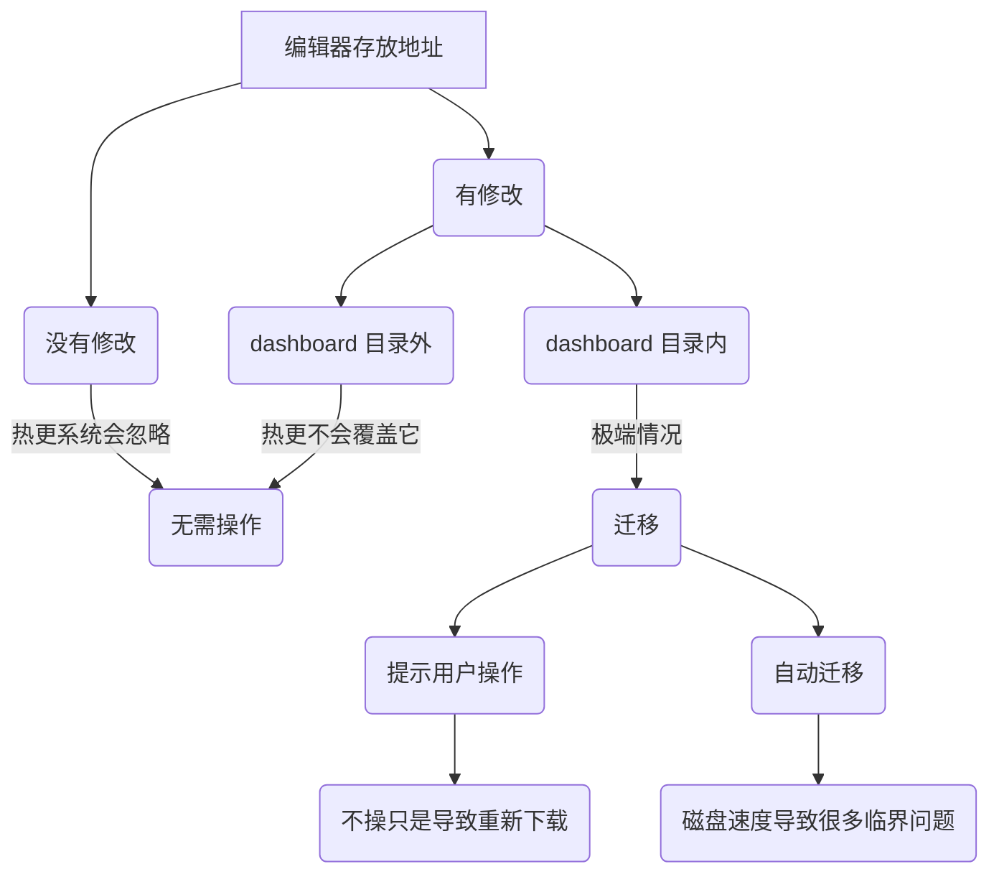
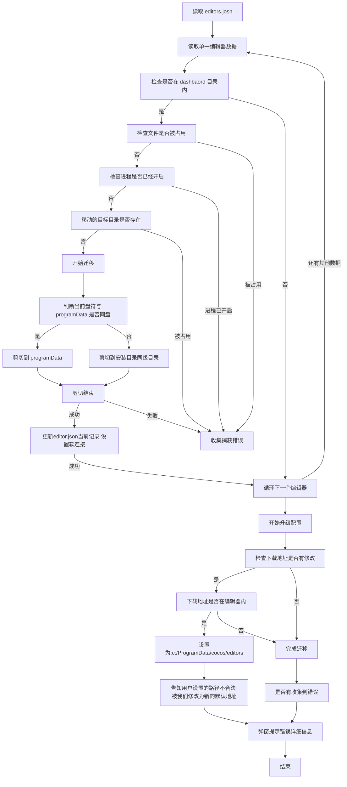
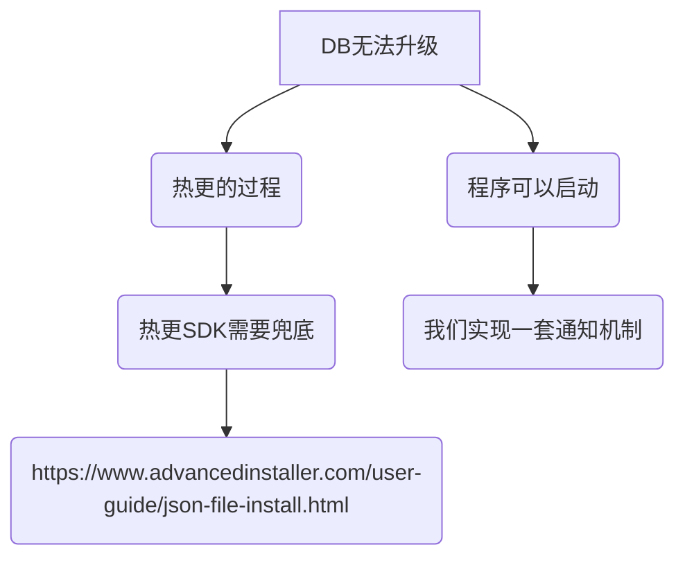
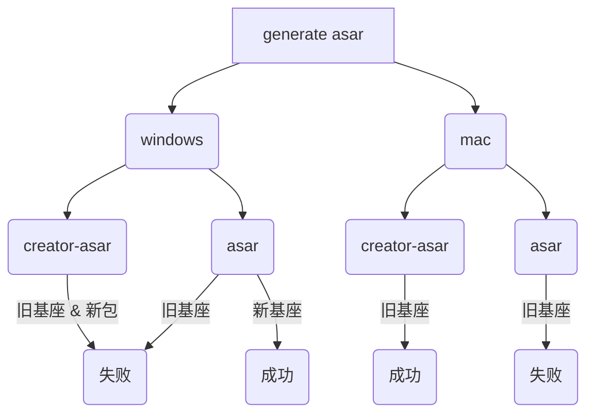

## 一些前提约定
- v1.2.6 热更能力发布之后，我们将在 1.3.x 进行版本迭代，2.x 的版本等 dashboard 下次界面有重大改动再使用

## 关于 v1.2.6 发布热更的版本示意图

v1.2.6 发布之后，用户的基座就具备了全量更新到 1.3.x 的能力，理想状态是 v1.2.6 作为 1.2.x 的最后一个版本，后续都在 1.3.x 继续开发。

但是！！

万一 v1.2.6 发布之后，出现了意外情况，我们也需要具备兜底的能力，需要在 v1.2.6 保留新旧的热更功能。即——— v1.2.6 可以更新到 v1.2.7，也可以更新到 1.3.x。

在 v1.2.6 发布之后
- 顺利：直接进行 1.3.0 的开发，走新的热更流程（旧热更可以废弃）
- 出错：发布 v1.2.7  v1.2.8 v1.2.9 直到解决问题，然后发布 v1.3.0

所以我们并不是 1.2.x 和 1.3.x 共存的关系，而是，1.2.x 发布热更能力直到没有任何问题，再发布 1.3.x。



#### 针对 1.2.6 发布失败后，我们发布了 1.2.7，然后又发布了 1.3.0 的情况，我们做了1.3.0的前置条件判断

在请求新版热更接口之前，请求旧版的热更，如果有数据即说明有发布 1.2.7 等，就跳过新热更的逻辑。

## 需要解决的问题

- [x] 实现新的热更
- [x] 升级弹窗共用
- [x] visual studio 的特供版
- [x] 关于 window 的已经下载的编辑器的处理流程
- [x] window上默认下载地址修改到 c:/ProgramData/cocos/editros
- [ ] 程序错误


### 实现新的热更
@yufengctbu 



### 升级弹窗共用
由于 v1.2.6 同时具备新旧2套热更能力，而我们又希望对于用户而且保留之前的交互体验，所以2套热更的通知弹窗是共用的，这边需要做判断处理。

### visual studio 的特供版
window 系统上，针对 visual studio 的特供版处理。

#### 背景
- visual studio 下载地址是一个特殊包，里面包含了 source: visual studio 的标记
- 微软平台不更新： 用户下载的是旧包，将通过 asar 的更新能力更新到 1.2.6，然后走热更更新到1.3.x
- 微软平台更新： 需要给微软重新打一个 内置 platform.config.json 的附带1.3.x 的热更的包 （频率不高）


#### 流程


#### 具体步骤
- v1.2.6 在 cocos.asar 引入一段脚本，用于将 platform.config.json 写入 const resourcesPath = join(app.getAppPath(), '../');
 ```js
const { join } = require('path');
const { writeFileSync } = require('fs');
const { app } = require('electron');

const resourcesPath = join(app.getAppPath(), '../');

module.exports.start = function(_, options = {}) {
    const source = options.source || 'Cocos';
    writeFileSync(
        join(resourcesPath, 'platform.config.json'),
        JSON.stringify({ source: source }, null, 4)
    );
};
 ```
- v1.3.x 将上面的脚本删除，在 app.asar 引入一个脚本，用于读取 platform.config.json ，组装 COCOS.init 的执行入参
```js
const { app } = require('electron');
const { join } = require('path');
const { readFileSync, existsSync } = require('fs');

const resourcesPath = join(app.getAppPath(), '../');
const jsonPath = join(resourcesPath, 'platform.config.json');

module.exports.get = function() {
    if (existsSync(jsonPath)) {
        try {
            const json = readFileSync(jsonPath, 'utf-8');
            return JSON.parse(json).source;
        } catch (e) {
            return 'Cocos';
        }
    }
    return 'Cocos';
};

```
- 后期如果需要给 windows 打过一个特供包，需要往应用程序里面 塞一个 platform.config.json。

### 关于 window 的已经下载的编辑器的处理流程

***方案一***  🙅 
通过将 .editors 文件夹加入忽略名单，在windows 10 验证可行，但是在 window 11 还是会全量卸载文件夹。虽然可以利用 [ advancedinstll 配置](https://www.advancedinstaller.com/user-guide/folder-removal-dialog.html) 指定只删除非空文件夹。 但是它只针对新发布的基座起作用，假设我们在 1.3.0 通过 advancedinstaller 配置好了，在热更 1.2.6 的时候，是不起作用的。

@yufengctbu  还做了如下尝试：
1、利用advance installer 添加powershell脚本实现
2、利用advance installer 自定义事件实现
3、配置升级前置事件实现
 
***废弃***


***方案二***  🙅 
在热更新的时候，对 .editors 文件夹进行移动（比如和应用同级目录），待热更完成，将其移动回来。这样在同一个盘里做移动操作速度是非常快的，但是经过调研，advancedinstaller 在进行程序热更是无法执行其他脚本的 。@yufen 确认。

***方案三***  👍

#### 为保证操作速度和规避容量问题，约定如下：
- 采用移动的方式进行数据迁移
- 不跨盘操作
#### 需要处理的问题
- 1.2.6 需要为存储编辑器预设新的默认地址 programData/cocos/editors or 应用同级目录的/dashboard-editors/

#### 交互
- 每次启动 Dashboard 都弹出提示直到迁移为止
- 全局常驻一个迁移提示
- 有待迁移编辑器的Dashboard不能进行新版的热更



## window上默认下载地址修改到 c:/ProgramData/cocos/editros

windows 关于数据存放的文件夹有2个：[参考来源](https://www.makeuseof.com/tag/difference-between-appdata-programdata/)
- AppData: 在用户目录下，一般存储针对于当前用户的私有数据
- ProgramData: 在 C 盘下，一般存储所有用户都可以访问的公共数据

同时在setting页面需要对用户设置的下载地址进行验证，不能设置在应用目录内。

### 程序错误



- 复制一套现有的公告模块，进行 web view的展示
- dashboard 发起请求参数为： dashboard的版本号，平台信息，后端根据这个数据判断是否需要通知用户回退
- 后端实现一个接口，不需要UI界面，逻辑写死，不用数据库。


## 有待验证的

### 关于 generate 环节  asar 的问题



已经解决： 

原因是我们针对 13.1.4 的electron进行了定制（区分平台 mac & win），它需要配套使用定制的 creator-asar(npm包) 进行打包。


## TODO
- [ ] 应该将所有旧的下载地址重定向到 1.3.x 的最新地址（只要有新版本，都应该更新重定向）
- [ ] 1.3.x 可以规划着把 app 这个底座去除，因为走了规范热更它就没作用了，不应该增加项目复杂度和代码量