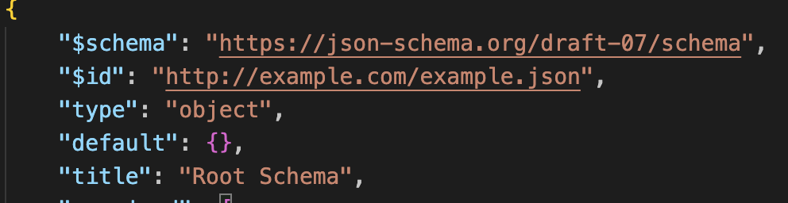

# JSON Schema

## 介绍

JSON Schema 是一种声明性语言，可用于注释和验证 JSON 文档的结构、约束和数据类型。它提供了一种标准化和定义 JSON 数据期望的方法。[官网](https://json-schema.org/overview/what-is-jsonschema)

最直观的体验就是我们在 vs code 编写 setting.json 的时候有配置信息的提示和校验。

## 教程

### 定义 JSON Schema

```json
{
    "$schema": "https://json-schema.org/draft-07/schema", // 声明 schema 的版本（需要目标编辑器支持）
    "$id": "http://example.com/example.json",
    "type": "object",
    "default": {},
    "title": "Root Schema",
    "required": ["checked", "dimensions", "id", "name", "price", "tags"],
    "properties": {
        "checked": {
            "type": "boolean",
            "default": false,
            "title": "The checked Schema",
            "examples": [false]
        },
        "dimensions": {
            "type": "object",
            "default": {},
            "title": "The dimensions Schema",
            "required": ["width", "height"],
            "properties": {
                "width": {
                    "type": "integer",
                    "default": 0,
                    "title": "The width Schema",
                    "examples": [5]
                },
                "height": {
                    "type": "integer",
                    "default": 0,
                    "title": "The height Schema",
                    "examples": [10]
                }
            },
            "examples": [
                {
                    "width": 5,
                    "height": 10
                }
            ]
        },
        "id": {
            "type": "integer",
            "default": 0,
            "title": "The id Schema",
            "examples": [1]
        },
        "name": {
            "type": "string",
            "default": "",
            "title": "The name Schema",
            "examples": ["A green door"]
        },
        "price": {
            "type": "string",
            "default": "",
            "title": "The price Schema",
            "examples": ["dd"]
        },
        "tags": {
            "type": "array",
            "default": [],
            "title": "The tags Schema",
            "items": {
                "type": "string",
                "title": "A Schema",
                "examples": ["home", "green"]
            },
            "examples": [["home", "green"]]
        }
    },
    "examples": [
        {
            "checked": false,
            "dimensions": {
                "width": 5,
                "height": 10
            },
            "id": 1,
            "name": "A green door",
            "price": "dd",
            "tags": ["home", "green"]
        }
    ]
}
```

建议通过这个网站 [jsonschema.net](https://www.jsonschema.net/) 生成 JSON Schema。

### 使用 JSON Schema

vs code 开箱支持 JSON Schema，我们只需要在 setting.json 中添加 `json.schemas` 字段，然后添加我们定义的 JSON Schema 即可。[官方文档](https://code.visualstudio.com/docs/languages/json)

```json5
{
    'json.schemas': [
        {
            fileMatch: ['cocos.json'],
            url: './cocos-schema.json', // JSON Schema 的路径 它相对于当前项目的 Root
        },
    ],
}
```

vscode 还有一种使用 JSON Schema 的方式，就是在 JSON 文档中添加 `$schema` 属性，然后指向我们定义的 JSON Schema。

```json5
{
    $schema: './cocos-schema.json', // 它也可以是一个在线的地址
    name: 'cocos',
    version: '1.0.0',
    description: 'Cocos Creator 项目配置',
}
```

这样，在 vs code 中打开名为 cocos.json 文件的时候，就会提示我们定义的 JSON Schema。

### 公共 Schema

前端开发中常用的如：`package.json` `tsconfig.json` `.prettierrc.json` 等都有对应的 JSON Schema 可以直接使用。它们存放在 [schemastore](https://www.schemastore.org)。常见的配置文件的 schema 都可以来这边搜索。它类似于 https://www.npmjs.com/ 的角色。

## JSON Schema 和 vs code 的关系

[JSON Schema](https://json-schema.org/overview/what-is-jsonschema) 负责推进语法，规范等。[规范列表](https://json-schema.org/specification)（类似 [ECMAScript](https://ecma-international.org/technical-committees/tc39/) 推出 es6、 7、 8、 9、 规范，各大浏览器厂商负责跟进规范具体实现。）

[VS Code](https://code.visualstudio.com/) 负责了编辑器的功能，包括代码提示、配置校验。

所以也存在 [JSON Schema](https://json-schema.org/overview/what-is-jsonschema) 推出的新规范，[VS Code](https://code.visualstudio.com/) 没有及时跟进的情况。

如下提示编辑器还没有支持声明的版本：


换成编辑器支持的版本：


## 总结

使用 [JSON Schema](https://json-schema.org/overview/what-is-jsonschema) 可以减少编写配置文件的工作量，降低配置出错的概率。

如果你是工具开发者，并且你的工具允许用户使用 json 文件来配置一些信息，那么由你提供的 schma 将极大提升用户的配置体验。
