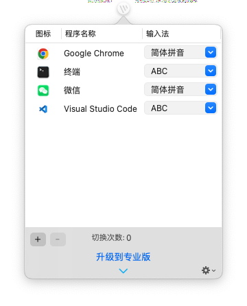

# Mac OS 装机指南

工欲善其事，必先利其器。作为靠编程谋生的程序员而言，一套量身定制的开发环境就如一把利剑对于一个闯荡江湖的武侠一样重要。

前提：

-   职业：WEB 前端开发
-   工具：MacBook Pro

由于 Mac OS 的干净整洁，一直都是我的电脑首选。从 16 年至今，都是使用 mac 开发，在此沉淀一篇配置文章，以便在更换电脑的时候，轻车熟路的进行配置。

个人性格原因，喜欢小而美，且一直坚持断舍离原则，只保留必要的东西，甚至可以忍受一点由于极简带来小麻烦。所以只要 macOS 自带的 APP 能满足我的基本需求，我就不会安装一个替代的第三方 APP。

我使用的原生 APP 有：

-   输入法、
-   备忘录、
-   邮件、
-   日历、
-   地图、
-   音乐、
-   截屏、
-   提醒事项、
-   keynote、
-   Safari（日常）

苹果的 APP 完成度非常高，相比国内的 APP 而言少了运营模块，整个 APP 完全面向生产力，无广告（零容忍），所以日常的 APP 我基本使用原生的。

## 电脑设置

得益于苹果强大的 iCloud 同步能力，在配置新电脑的时候只要登陆 Apple ID，所有数据都会同步过来（照片、备忘录、提醒、文档等等）。只需做一些简单设置，就可以进行日常使用。

### 改名字

[官方指导](https://support.apple.com/zh-cn/guide/mac-help/mchlp2322/mac)，先给电脑设置一个好听的名字吧！

如果不设置，那么默认名称为 username@macbook

### 搜索引擎

将 Safari 和 Chrome 的首页设置为 Bing，搜索引擎切换为 Bing，因为他们默认的都是垃圾百度引擎，为什么不设置成谷歌？原因你懂，而且 Bing 有国内版和国际版本，也基本够用了。

### 调度中心

-   关闭 根据最近的使用情况自动重新排序列空间（这样不会打乱自己排布好的屏幕顺序，影响体验）

### 桌面与程序坞

-   开启 将窗口最小化至应用程序图标（这样就不会额外显示最近打开的应用）
-   关闭 在程序坞中显示最近使用的应用程序
-   关闭 点按墙纸以显示桌面

### 输入法，短语

350783 快捷输入身份证号码

### 鼠标跟随速度

由于妙控鼠标在系统可视化设置里最高只能设置 3 ，移动鼠标需要较大的手腕弧度，我一般设置成 12 ，符合我个人的使用习惯。

```
defaults read -g com.apple.mouse.scaling
defaults write -g com.apple.mouse.scaling 12
```

## 必装软件

### 自动切换输入法

[官方地址](https://www.better365.cn/AutoSwitchInput.html)，由于编程开发是英文，交流沟通是中文，所以在微信和 vscode 等软件来回切换的时候经常都要切换中英文。你是英文状态下在 vscode 写代码，切到微信回复个消息要切换到中文，然后回到 vscode 又要切成英文，非常繁琐，`自动切换输入法lite` 是一款免费的小软件，可以设置不同软件在激活的时候自动切换到指定的语言。典型的小而美的软件 👍。



### MooM

这是 mac 上一款管理窗口的付费软件，我最常用的就是左右分屏功能，由于在公司用的是 27 寸 4K 显示器，我可以轻松的将 Chrome 和 vscode 左右分屏，一边负责代码，一边负责页面呈现和调试，无需窗口切换，非常高效。

设置 -> mouse -> zoom button controls > pop up controls when hovering over a zoom button (取消勾选)

避免和系统自带的左右分屏冲突，moom 只保留鼠标拖拽到屏幕边缘触发分屏.

### iHost

管理本地 host 的免费软件，可以轻松的对 host 文件进行编辑和分类，自由的切换分组。[Github](https://github.com/toolinbox/iHosts)

### 视频播放器

开源播放器[iiNA](https://iina.io)，只专注于视频播放，没有其他附属功能。

### 欧陆词典

欧陆词典它只是在状态栏有一个搜索图标，方便随时查询单词。

### 解压软件 （废弃）

之前一直使用的是 [keka](https://github.com/aonez/Keka)，直到写这篇文章的时候，发现我上次装机忘记装 keka 了，也一直正常使用到现在，所以我大概率是不需要解压软件了，mac 自己可以对 zip 文件进行压缩和解压，满足我极少情况下的需求。可能是职业原因，基本文件都在云上，压缩文件这类“本地处理”的情景越少了。

### SCROLL REVERSER（鼠标反转）

如果你不是使用妙控鼠标，而是罗技等第三方鼠标，那么滚轮的方向和触摸板的方向是不一致的，可以使用这款[软件](https://pilotmoon.com/scrollreverser/?_blank)颠倒一下鼠标滚轮方向。

### 官方实用软件

[开发者实用工具](https://developer.apple.com/download/all/?q=Additional)，比如系统级别的网络设置，类似 chrome 上的网络设置。

## 系统快捷键

[官方地址](https://support.apple.com/zh-cn/HT201236)

| 快捷键                | 功能                             |
| --------------------- | -------------------------------- |
| cmd + shift + .       | 显示/隐藏 被隐藏的文件           |
| cmd + shift + opt + v | 把富文本粘贴为纯文本             |
| cmd + ctr + Q         | 锁屏                             |
| cmd + shift + G       | 进入文件夹                       |
| cmd + opt + esc       | 强制关闭面板                     |
| cmd + shift + 3       | 全屏截图 （加 ctr 截图到粘贴板） |
| cmd + shift + 4       | 自定义区域截图                   |
| cmd + shift + 4       | 再按 space 键（截图程序窗口）    |

## 开发环境

### IP 地址

由于屏(bi)蔽(guan)糟(shuo)粕(guo)的政策，我们和外界的沟通渠道被切断，导致在安装一些国外的软件的时候，会无休止的卡在 loading 状态，或者类似报错:

```
Failed to connect to raw.githubusercontent.com port 443: Connection refused
```

1、 在 [这里](https://www.ipaddress.com) 查询 raw.githubusercontent.com 的真实 IP

2、 在 host 文 件里配置 IP 映射 （推荐[iHost](https://github.com/toolinbox/iHosts)）

```
199.232.28.133 raw.githubusercontent.com
199.232.68.133 raw.github.com
140.82.113.4 github.com
```

以上设置只能解决链接 github 的问题，我们有很多软件都是使用国外的，所以几乎是必须准备一个 🪜。mac 上推荐使用 [ShadowsocksX](https://github.com/shadowsocks/ShadowsocksX-NG) 和 [clashX](https://github.com/yichengchen/clashX)。

### 必备软件

-   [chrome](https://www.google.cn/chrome/index.html) 登陆谷歌账号可以同步所有书签和账号密码
-   [vscode](https://code.visualstudio.com/) 登陆 github 账号可以同步所有偏好设置和插件
-   [Git](https://git-scm.com/downloads)
-   [nvm](https://github.com/nvm-sh/nvm) 用于管理 node
-   [node](https://nodejs.org/en/) 推荐直接使用 nvm 安装。
-   [oh-my-zsh](https://ohmyz.sh/) (提供非常多的快捷命令：如 gst = git status)
-   [HomeBrew](https://brew.sh/zh-cn/) （安装开发软件很实用 如 brew install nginx）[墙内安装脚本](https://gitee.com/cunkai/HomebrewCN)

#### oh-my-zsh

这个如果没有 🪜 很难安装。这边推荐使用[国内镜像](https://gitee.com/mirrors/oh-my-zsh/)

根据如下步骤：

-   进入到用户根目录 （正常直接打开终端，默认就是）。

-   下载安装脚本：

```bash
wget https://gitee.com/mirrors/oh-my-zsh/raw/master/tools/install.sh
```

-   赋予安装脚本权限：

```bash
chmod +x install.sh
```

-   执行脚本

```
./install.sh
```

> 如果没有 🪜，可以修改一下该脚本

vim ./install.sh

```sh
# Default settings
ZSH=${ZSH:-~/.oh-my-zsh}
REPO=${REPO:-ohmyzsh/ohmyzsh}
REMOTE=${REMOTE:-https://github.com/${REPO}.git}
BRANCH=${BRANCH:-master}
```

改为 (注意第 2、3 行配置)

```sh
# Default settings
ZSH=${ZSH:-~/.oh-my-zsh}
REPO=${REPO:-mirrors/ohmyzsh}
REMOTE=${REMOTE:-https://gitee.com/${REPO}.git}
BRANCH=${BRANCH:-master}
```

按 esc 键退出编辑模式

按 :wq 保存

重新执行 ./install.sh

-   安装插件

```bash
git clone https://github.com/zsh-users/zsh-syntax-highlighting.git ${ZSH_CUSTOM:-~/.oh-my-zsh/custom}/plugins/zsh-syntax-highlighting

git clone https://github.com/zsh-users/zsh-autosuggestions ${ZSH_CUSTOM:-~/.oh-my-zsh/custom}/plugins/zsh-autosuggestions

```

将插件声明到配置文件 .zshrc

```sh
plugins=(git nvm zsh-syntax-highlighting zsh-autosuggestions)
```

-   更新 .zshrc 配置

```bash
source .zshrc
```


### 环境准备

配置 Github 和 Git

```
ssh-keygen -t rsa -C "GitHub的注册邮箱"

// 一路回车

// 验证是否成功
ssh -T git@github.com

// 一般会报错如下：
Permission denied (publickey)

// 将刚才生成的 id_rsa.pub 的内容复制到 [Github](https://github.com/settings/keys)

// 再次验证

Hi yuanweihai! You've successfully authenticated,
but GitHub does not provide shell access. &nbsp;

git config --global user.email "邮箱地址"
git config --global user.name "你的名字"

```

以上我们就完成了 web 开发的最基本设置。可以 git clone 你的代码仓库到本地进行开发了。
