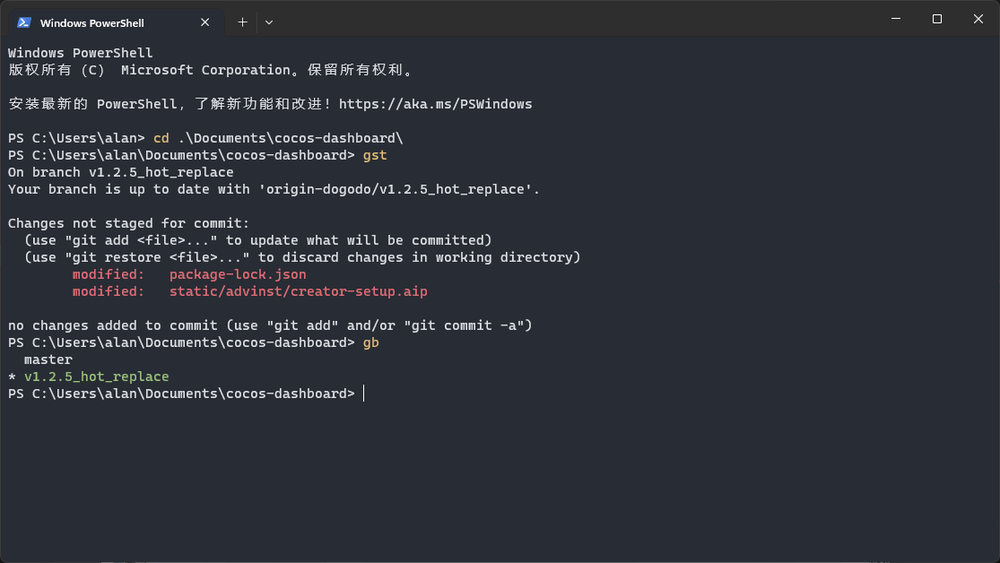

# Windows 装机指南

## 安装 windows 系统

-   进入[官方地址](https://www.microsoft.com/zh-cn/software-download/windows11)
-   选择第二种方式（创建 Windows 11 安装）
-   准备一个 U 盘即可

## 登录微软账号

如果链接不上微软服务器，可以按照如下的方式设置一下 DNS 。


> 如果有使用代理，需要关闭系统代理

## 快捷键

> 只列出使用频率高的，例如 win + B 跳转系统托盘的就不记录了，感觉对效率没有提升，不增加记忆负担。[官方文档](https://support.microsoft.com/zh-cn/windows/windows-%E7%9A%84%E9%94%AE%E7%9B%98%E5%BF%AB%E6%8D%B7%E6%96%B9%E5%BC%8F-dcc61a57-8ff0-cffe-9796-cb9706c75eec)

| 快捷键          | 功能                         |
| --------------- | ---------------------------- |
| win + A         | 快捷设置面板： WIFI 蓝牙 ... |
| win + D         | 显示桌面                     |
| win + E         | 打开资源管理器               |
| win + H         | 启动微软的听写               |
| win + I         | 打开设置                     |
| win + L         | 锁屏                         |
| win + M         | 窗口最小化                   |
| win + N         | 显示通知 日历面板            |
| win + Q/S       | 打开搜索                     |
| win + V         | 显示云剪切板                 |
| win + Z         | 打开窗口布局                 |
| win + shift + S | 专业截屏                     |
| win + Home      | 最小化非活动窗口             |

## 必备软件

> Windows 系统现在也有官方的 Store 了，常规软件如：微信、QQ 音乐等建议优先使用 Store 下载安装，可以最大程度避免垃圾软件。

> 如果是一些开发软件，推荐使用包管理器 [winget](https://github.com/microsoft/winget-cli) 安装。

-   [winget](https://github.com/microsoft/winget-cli) window 上的包管理器，类似 Mac OS 的 homebrew
-   [Git](https://git-scm.com/)
-   [vscode](https://code.visualstudio.com/)
-   [nvm](https://github.com/coreybutler/nvm-windows) node 版本管理工具
-   [chrome](https://www.google.cn/intl/en_uk/chrome/)
-   [压缩工具 7z](https://www.7-zip.org/) (可能 windows 12 就不用了，系统都会内置)
-   [Clash](https://github.com/Fndroid/clash_for_windows_pkg/releases) & [使用教程](https://clashforwindows.top/)
-   [windTerm](https://github.com/kingToolbox/WindTerm) terminal+ssh+sfpt （据说很好用，当前用不到，未验证）

## 终端

[windows terminal](https://learn.microsoft.com/zh-cn/windows/terminal/install) 是微软官方推出的终端工具，可以整合 cmd、powershell 等。它具有更现代的外观，可以配置主题，极大的提升了操作体验。

推荐使用 [powershell](https://learn.microsoft.com/zh-cn/powershell/scripting/learn/ps101/01-getting-started?view=powershell-7.3) 当作默认的 shell 工具，抛弃陈旧的 cmd 吧。我们可以在 powershell 中配置一些 [Alias](https://learn.microsoft.com/zh-cn/powershell/module/microsoft.powershell.utility/set-alias?view=powershell-7.2) 让它的使用体验媲美 mac 上的 zsh .

配置地址：

```bash
C:\Users\alan\Documents\WindowsPowerShell\Microsoft.PowerShell_profile.ps1
```

或者启动 powershell 输入 code $PROFILE 即可打开配置文件进行配置。

```

# Setup other alias
Set-Alias open Invoke-Item
Set-Alias ../ GoBack

function GoBack {Set-Location ..}


# Setup git alias
Set-Alias glog GitLogPretty
Set-Alias gst GitStat
Set-Alias gco GitCheckOut
Set-Alias gcom GitCheckOutMaster
Set-Alias gb GitBranch

function GitLogPretty {git log --graph --pretty='%Cred%h%Creset -%C(auto)%d%Creset %s %Cgreen(%cr) %C(bold blue)<%an>%Creset' --all}
function GitStat {git status}
function GitCheckOut {git checkout}
function GitCheckOutMaster {git checkout 'master'}
function GitBranch {git branch}
```

最终效果如下图，界面好看，且支持 gst 等快捷命令。



### 实用命令

-   open . 将当前的文件地址在资源管理器中打开
-   notepad $profile 打开当前 shell 的配置文件 （notepad 是 windows 内置的文本编辑工具）

## PowerToys

微软官方的实用工具，具体功能有点类似 mac 的聚焦，可以快速搜索。[下载地址](https://learn.microsoft.com/zh-cn/windows/powertoys/)

windows 11 自带一个全局的搜索功能了，下载它的主要目的是为了做键盘映射。由于主要设备是 mac ，切换到 win 最不习惯的就是中英文切换。

mac 中英文切换的快捷键对应在 win 上是 Lock 键（每次我习惯性的按它进行切换语言都是启动了大写锁定）。于是在 windows 上我将 Lock 映射成了 shift，这样在保持肌肉记忆的同时，也可以顺利的进行中英文切换。

> 对于需要输入大写的情况我都是长按 shift 键来实现的，因为日常工作非常少的情况需要连续输入很多大写字母。
