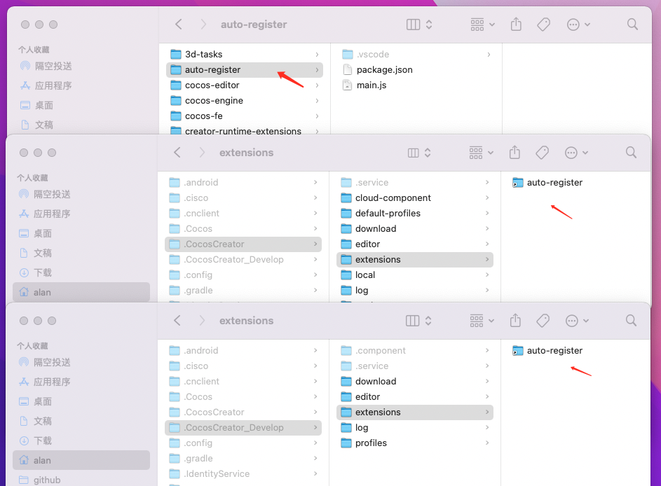

# 软链接的使用

软链接可以创建文件的引用路径，让一个文件拥有多个访问路径。像章鱼的多个触脚，每个触脚都可以直达章鱼的真身。

## 使用场景

我们的编辑器在启动的时候会根据当前模式（正常｜开发）去不同的路径获取配置文件，扫描全局插件等。而此时如果你在开发一个全局插件，在没有使用软链接的情况下，你只能在每个环境的文件夹下放置该全局插件。

```bash
/Users/alan/.CocosCreator_Develop/extensions/your-plugin
/Users/alan/.CocosCreator/extensions/your-plugin
```

这样不方便维护，你需要不断的复制同步代码。通过软链，你可以把 `your-plugin` 放置在你平时的开发文件夹。然后通过配置软链接让两个环境下的 extensions 文件夹都有 `your-plugin` 的引用。

```bash
ln -s /Users/alan/cocos/auto-register /Users/alan/.CocosCreator_Develop/extensions/auto-register
ln -s /Users/alan/cocos/auto-register /Users/alan/.CocosCreator/extensions/auto-register
```

这样你可以正常的开发你的插件，而不同环境的配置路径都拥有访问该插件的软链接。非常方便。

## 命令

```bash
# 创建
ln -s 原文件路径 目标软链接路径

# 查看(查看当前目录下，哪些文件是软链接)
ls -li

# 删除
rm 目标软链接路径
```

也可以直接在文件管理器里直接删除。

## 效果


