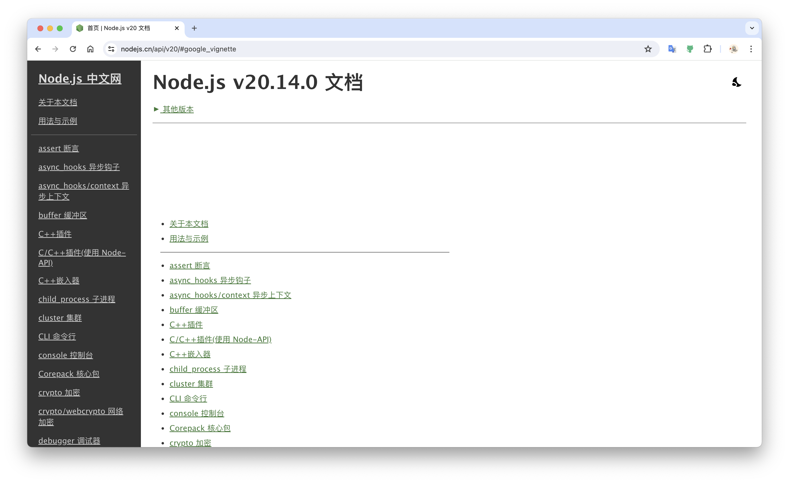

# 多版本多语言的文档系统设计

## 前言

本文记录了 cocos creator [用户手册](https://docs.cocos.com/creator/3.8/manual/zh/) 的重构过程中遇到的问题和解决方案，以及个人对多版本多语言的文档系统的可维护性的一些见解。

## 旧文档存在的问题

### 开源项目不再维护了

[用户手册](https://docs.cocos.com/creator/3.8/manual/zh/) 这个项目大约创建于 2017 年左右，当时选用的是 [GitBook](https://www.npmjs.com/package/gitbook-cli) 。目前该项目已经处于冻结状态，最后一次版本更新已经是 7 年前了(当前时间 2024.05.06)。官方已经将 [GitBook](https://www.gitbook.com/) 商业化，变成一个提供在线文档的服务平台。

当然，项目冻结不维护不是什么大问题（如果它依然稳定运行的话）哪怕我们为了它锁定 node 版本，甚至定制一个开发机器专门运行它也没关系，但是最近文档维护人员说项目启动不了。**(说明它不稳定，是个定时炸弹)**。

### 性能差

本地开发模式预览启动需要二十多分钟，构建发布也需要二十多分钟。

### 扩展性差

站在 2024 年这样的时间看 GitBook 的插件系统设计，显得不那么灵活和易用。

如果想对默认主题进行拓展和定制，不如 [vitepress](https://vitepress.dev/) 灵活方便。

比如它的插件下载并不是通过 npm 进行安装的，而是自己有一个 install 的流程，在前端工作流中显得有点割裂。而这次文档系统启动失败原因就是有个插件`突然`安装失败了。


### 多版本管理繁琐 （重点）

目前文档的多版本是通过 Git 的分支管理的


这就意味着如果我们修复以上的插件安装报错的问题，需要切到这 10 多个分支去依次提交同样的 PR，有点崩溃。而且这种崩溃在每次发布新版本的时候，都要经历一次。因为我们的文档中有个`版本列表`，它列举了所有已经发布的文档版本。具体配置在 `en/book.json` 和 `zh/book.json` 中:

```json
{
    "variables": {
        "version": [
            {
                "name": "3.7",
                "links": [
                    {
                        "name": "3.8",
                        "link": "https://docs.cocos.com/creator/3.8/manual/en"
                    },
                    {
                        "name": "3.7",
                        "link": "https://docs.cocos.com/creator/3.7/manual/en"
                    },
                    {
                        "name": "中间省略一堆版本"
                    },
                    {
                        "name": "1.10",
                        "link": "https://docs.cocos.com/creator/1.10/manual/en"
                    },
                    {
                        "name": "1.9",
                        "link": "https://docs.cocos.com/creator/1.9/manual/en"
                    }
                ]
            }
        ]
    }
}
```

查看截图右上角的版本下拉列表：

为了方便用户在阅读文档的时候切换不同的版本。

**假设我们要发布一个新版本 `3.9` 那么就需要切到 3.8 之前的所有分支，依次添加 3.9 的数据，重新构建文档进行发布。这是一件非常费时且无意义的工作。**

### 问题总结

-   文档依赖的 GitBook 已经是一个七年前就废弃的项目，且事实证明它不稳定，是个雷点
-   由于 GitBook 的技术老旧，每次构建起码要 25 分钟左右
-   后续想继续对文档系统进行功能拓展有一定困难
-   目前多版本管理的方式是以 git 的分支形式，不利于代码复用，新版本发布繁琐

## 重构方案

用 [vitepress](https://vitepress.dev/) 替代 Gitbook，它是一个极简且现代的文档构建框架，同样具备完善的插件体系，而且开箱即用的功能已经基本覆盖我们现有需求。

我们来剖析一下现有的文档具备的功能模块：


除了 `版本列表` 和 `问题反馈` 不是开箱支持，其他都是 viteprss 默认就提供的，而 `版本列表` 和 `问题反馈` 可以轻松的通过拓展默认主题来实现。

### 自定义主题

```ts
import { h } from 'vue';
import DefaultTheme from 'vitepress/theme';
import versionList from './versions-list.vue';
import feedback from './feedback.vue';
import { github } from '../config';

export default function (version: string) {
    return {
        extends: DefaultTheme,
        Layout() {
            return h(DefaultTheme.Layout, null, {
                'nav-bar-content-after': () =>
                    h(versionList, {
                        currentVersion: version,
                    }),
                'aside-ads-after': () =>
                    h(feedback, {
                        repo: github,
                    }),
            });
        },
    };
}
```

[vitepress](https://vitepress.dev/) 的默认主题提供了非常多且实用的插槽，我们可以轻松的拓展页面结构。

得益于 vitepress 的 [运行时 API](https://vitepress.dev/zh/reference/runtime-api#usedata)，我们在拓展`问题反馈`这个按钮的时候还可以直接带上当前文件的地址，方便快速定位到问题所在的文件。
<video controls src="./assets/fadeback.mov" />

### 多版本管理

我们直接废弃之前的 git 分支管理多版本，而采用文件夹的方式来隔离多版本。

新的项目结构如下：


-   `versions` 文件夹下面管理了所有版本，每个版本对应一个文件夹。
-   `@config` 文件夹维护了 vitepress 的公共配置，比如主题的定制等代码都在这边维护
-   `public` 是站点的公共数据，将它提出来不是必须的，但是提出之后，每个版本都用软连接访问它，可以极大的减少项目的体积。比如一张图片 1m，我们有文档发布了 20 个版本，那么它就有 20m，所以我这边将 public 挪到外面当作公共文件夹~

> 最终放弃通过软连接共享 public 的策略，因为在配置 .gitignore 的时候无法把这个软连接忽略，需要在工作流上做一些定制处理，为了项目的稳定性，不增加多余的噪音，还是直接每个版本文件夹里携带一份 public 文件夹吧。否则需要在 postinstall 的钩子生成软连接，然后在 commit 的钩子删除软连接，增加了理解和维护的成本。

每个文件夹代表一个版本，除了文档内容，里面只有一个 `config/version.ts` 是每个版本自定义的，用于标注版本信息，其他配置都是通过引用外面的 @config 的公共配置。


### 侧边栏导航的数据迁移

重构遇到最大的问题是之前 gitbook 的导航数据是配置在 `SUMMARY.md` 里，格式如下：

```md
# Summary

[Cocos Creator User Manual 3.8](index.md)

## Introduction

-   [About Cocos Creator](getting-started/introduction/index.md)
-   [Support](getting-started/support.md)

## Understanding the Basics

-   [Getting Started](getting-started/index.md)

    -   [Install and Launch](getting-started/install/index.md)
    -   [Dashboard](getting-started/dashboard/index.md)
    -   [Hello World!](getting-started/helloworld/index.md)
    -   [Project Structure](getting-started/project-structure/index.md)

-   [Editor Interfaces](editor/index.md)
    -   [Scene](editor/scene/index.md)
    -   [Hierarchy](editor/hierarchy/index.md)
    -   [Assets](editor/assets/index.md)
    -   [Inspector](editor/inspector/index.md)
    -   [Console](editor/console/index.md)
    -   [Preferences](editor/preferences/index.md)
    -   [Project Settings](editor/project/index.md)
    -   [Main Menu](editor/mainMenu/index.md)
    -   [Tool Bar](editor/toolbar/index.md)
    -   [Editor Layout](editor/editor-layout/index.md)
    -   [Preview & Debugging](editor/preview/index.md)
-   [Glossary](glossary/index.md)
-   [Cocos Creator Quick Guide for Unity Developers](./guide/unity/index.md)
```

但是 vitepress 的导航数据格式是一个 js 数组，格式如下：

```json
[
    {
        "text": "Introduction",
        "collapsed": false,
        "items": [
            {
                "text": "About Cocos Creator",
                "link": "getting-started/introduction/index.md"
            },
            {
                "text": "Support",
                "link": "getting-started/support.md"
            }
        ]
    }
]
```

由于每个版本的菜单配置有 500 多行数据，而且我们需要迁移将近 20 多个版本，所以人工手动迁移数据是不现实的，所以需要写个 node 脚本来转换菜单数据。

::: details 展开查看 node 脚本

```js
import { readFile, writeFile, existsSync } from 'node:fs';
import { join, dirname } from 'node:path';

// 读取Markdown文件内容
function readMarkdownFile(filePath) {
    return new Promise((resolve, reject) => {
        readFile(filePath, 'utf8', (err, data) => {
            if (err) reject(err);
            else resolve(data);
        });
    });
}

const list = [];

function countLeadingSpaces(str) {
    const match = str.match(/^\s*/); // 匹配字符串前面的空格
    return match ? match[0].length : 0;
}

function extractContent(str) {
    // 匹配中括号内容
    const bracketRegex = /\[([^\]]*)\]/;
    // 匹配圆括号内容
    const parenthesesRegex = /\((.*?)\)/;

    // 使用正则表达式的exec方法查找匹配项
    const bracketMatch = bracketRegex.exec(str);
    const parenthesesMatch = parenthesesRegex.exec(str);

    // 提取并返回匹配的内容
    const text = bracketMatch ? bracketMatch[1] : undefined;
    const link = parenthesesMatch ? parenthesesMatch[1] : undefined;

    return {
        text,
        link,
    };
}

function getLast(list) {
    return list[list.length - 1];
}

function pushItem(parent, item) {
    if (Array.isArray(parent.items)) {
        parent.items.push(item);
    } else {
        parent.items = [item];
    }
    // 一级菜单配置了 collapsed = false，其他层级需要默尔收起折叠
    parent.collapsed ??= true;
}

function parseMarkdownToJSON(str) {
    const lines = str.split('\n').filter((v) => {
        // 只保留 ## 和 - 开头的内容
        return /^(##|\s*-)/.test(v);
    });

    for (let line of lines) {
        if (line.startsWith('##')) {
            list.push({
                text: line.replace('##', '').trim(),
                collapsed: false,
                items: [],
            });
        } else if (line.trim().startsWith('-')) {
            const count = countLeadingSpaces(line);
            if (count % 4 !== 0) {
                console.error(line, '格式错误，请确保 4 个空格的缩进');
                return;
            }
            let level = count / 4;
            const item = extractContent(line);

            switch (level) {
                case 0:
                    pushItem(getLast(list), item);
                    break;
                case 1:
                    pushItem(getLast(getLast(list).items), item);
                    break;
                case 2:
                    pushItem(getLast(getLast(getLast(list).items).items), item);
                    break;
                case 3:
                    pushItem(getLast(getLast(getLast(getLast(list).items).items).items), item);
                    break;
                case 4:
                    pushItem(getLast(getLast(getLast(getLast(getLast(list).items).items).items).items), item);
                    break;
                case 5:
                    pushItem(getLast(getLast(getLast(getLast(getLast(getLast(list).items).items).items).items).items), item);
                    break;
                default:
                    break;
            }
        } else {
            console.warn(line + 'is not available!');
        }
    }
    return list;
}

// 主函数
async function main() {
    const root = process.cwd();
    // 在 vscode 上，找到 SUMMAEY.md , 右键复制相对路径 当作该脚本的执行参数
    const summaryFile = process.argv[2] || 'undefine';
    const summaryFilePath = join(root, summaryFile);

    if (!existsSync(summaryFilePath)) {
        return console.log(summaryFile + 'is not exist!');
    }

    try {
        const __dirname = dirname(summaryFilePath);
        const markdownContent = await readMarkdownFile(summaryFilePath);
        const jsonData = parseMarkdownToJSON(markdownContent);

        // 删除需要隐藏的导航
        ['CC_HIDE_IN_SUMMARY_START', 'CC_HIDE_IN_SUMMARY_END'].forEach((text) => {
            const i = jsonData.findIndex((v) => v.text === text);
            if (i !== -1) {
                jsonData.splice(i, 1);
            }
        });

        writeFile(join(__dirname, 'summary.json'), JSON.stringify(jsonData, null, 4), function () {});
    } catch (error) {
        console.error('Error:', error);
    }
}

main();
```

:::

在迁移的时候只需要执行：

```bash
node ./scripts/create-sidebar.js versions/3.7/en/SUMMARY.md
```

它将会在同级目录生成一个 `summary.json` 的文件，里面是符合 vitepress 的导航数据格式。

### 多版本列表

原来的多版本列表是在构建文档的时候使用静态数据的，导致每次发布新版本，都需要去重新构建，所以这块数据最好是使用动态拉取的，我们在 oss 维护一份 versions.json 数据，在访问文档的时候动态拉取，这样后期增加新版本就可以及时更新且不用重新构建之前的版本。

### 全局变量的替换

旧文档中使用了 `__APIDOC__` 这样的占位字符串，在构建的时候替换成了对应的在线地址，因为它需要区分测试环境和正式环境。

在 vitepress 中虽然没有环境变量的配置，不过我们可以通过编写 markdown-it 的插件来实现，具体可以看这个 PR: [feat: 支持通过 env 文件替换全局变量](https://github.com/cocos/cocos-docs/pull/2928)

## 成果

下图是通过 vitepress 重构过的文档系统：


我们完整的实现了现有的所有功能，是的，那个 `社交分享` 被我忽略了，因为我觉得这是一个一厢情愿的功能，几乎不会有人会将文档地址分享到自己的社交账号去的，没必要在这边多一个摆设，文档系统就应该是页面简洁且聚焦。

而且带来的如下优势：

-   省略了 gitbook install 的缓慢环节
-   启动速度从之前的 20 多分钟，直接提到了不到 1 分钟
-   多版本在同一个分支维护，可以共用基础代码
-   版本列表以动态数据呈现，发布新版本不用重新构建旧版本
-   美观度也提升不少
-   得益于 vitepress 默认主题的多端适配，我们的移动端体验也有了巨大的提升

## 部署

我们先来看下一般`多版本多语言`的文档系统会以什么形式发布。

### 根据国家部署不同域名

-   https://nodejs.org/docs/latest/api/
-   https://nodejs.cn/api/

比如 nodeJs 的文档，感觉这个是最不推荐的部署方式，首先成本较大，需要申请所有国家的域名。而且服务器的运维成本也会增加。

当然 nodeJs 的多语言是因为官方只提供了英文文档，中文文档是国人自行翻译的。并不是同一个主体。




### 根据国家和版本部署不同的子域名

-   https://v2.cn.vuejs.org
-   https://cn.vuejs.org
    
    

优点是可以更突出版本和语言，vue 采用这种方式是因为它的文档的版本发布本来就是低频操作，它们只有发布大版本，才需要不同的路径来区分版本。而且它们不同版本的文档内容会有非常大的变化，所以会以版本的维度也进行一个子域名解析。

缺点就是它只适合版本不会很多的文档，否则维护域名解析都有一串长长的列表，还有 https 证书什么的也要重复申请。（免费证书似乎不能模糊匹配？）

### 根据路径来区分版本和语言

-   https://docs.unity.cn/cn/2023.1/Manual/Input.html
-   https://docs.cocos.com/creator/3.8/manual/zh/


这样的好处是只要解析一个域名就可以，把每个版本部署在不同的路径下，只要 nginx 那边做好配置，配合阿里云之类的云存储，就可以做到自动化部署（发布一个新版本，只是额外创建一个文件夹的事情）

部署到子路径有个细节需要注意就是，如果使用 vitepress 构建，需要配置好 [base](https://vitepress.dev/guide/asset-handling#base-url)

比如 cocos creator 的用户手册的部署域名是：

**https://docs.cocos.com/creator/3.8/manual/**

我们需要声明好如下配置：

```js
export default defineConfig({
    ...shared,
    base: `/creator/${version}/manual/`,
});
```

因为 SPA 的网页是由客户端接管路由，所以需要声明好 base，客户端才能正确解析路由地址。

由于 vitepress 天然支持[多语言](https://vitepress.dev/zh/guide/i18n)的配置，所以我们只需要按版本去发布，多语言只是在发布地址上追加语言路径即可。

比如我们发布了 3.8 版本路径是： https://docs.cocos.com/creator/3.8/manual/ 。

那么对应的多语言路径就是：

-   https://docs.cocos.com/creator/3.8/manual/zh
-   https://docs.cocos.com/creator/3.8/manual/en
-   https://docs.cocos.com/creator/3.8/manual/ja

## 发布

我们采用了同一个分支管理所有版本还带来了一个好处，可以在同一个分支指定需要构建发布的版本，比如我们发现文档的 3.6 有个文字写错了，那么我们在提交 PR 进行修复的时候可以在 commit 带上这样的信息：

`feat(publish:3.6): some other message`

在 github 的 workflow 中可以摘取提交信息中的版本，然后针对当前版本做构建和发布。

如果我们统一升级了 vitepress 或者其他公共组件，需要对所有版本进行重新构建和发布，那么只需要这样提交 commit:

`feat(publish:all): some other message`

github workflow 在提取到 `all` 这个关键词，就会全量构建所有版本。

整个文档的构建和发布的大体流程如下：


## 总结

多语言多版本的文档系统，重要的是多版本在同一个分支进行维护，这样才能共享基础代码，不同的版本只用文件夹进行隔离。

是否使用 vitepress 在这样的设计体系下就变得不太重要了。我们的核心资产是那些 markdown 文件和整个项目结构设计与自动化发布流程的设计。如果后期我们发现了比 vitepress 更好的文档系统，迁移也是非常快速的。
